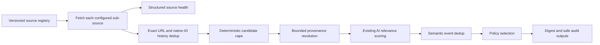

# Horizon Source Quality V2 Design

Status: Local V2 implementation and manual Actions shadow workflow are ready for review; production promotion and seven-day qualification are not complete

Scope: opt-in local CLI plus a read-only, manually triggered Actions shadow; the existing daily Pages workflow remains unchanged

Compatibility target: additive changes to the current `1.0` configuration and item contracts

## 1. Decision summary

Horizon Source Quality V2 separates four concerns that are currently conflated:

1. **Discovery**: where Horizon found an item.
2. **Provenance**: how close the linked evidence is to the original event.
3. **Relevance**: the existing AI importance score.
4. **Runtime health**: whether each configured source actually succeeded.

The production digest must no longer treat every discovery channel as equivalent. L1/L2/L3 remains a provenance-distance label, not a truth score. Community sources remain useful for discovery, but L3-only items receive a bounded number of digest slots unless Horizon resolves them to stronger original evidence.

The production rollout remains local-first. The implementation also includes a manually triggered, read-only GitHub Actions shadow so the same safe contract can be exercised in CI without scheduling, writing Pages, or changing the existing daily workflow. Production Actions and Pages stay unchanged until the acceptance gates pass.



## 2. Baseline and problem statement

The committed Actions configuration enables five source families and twelve configured sub-sources: four GitHub entries, Hacker News, four RSS feeds, two subreddits, and one Telegram channel. The public source catalog contains 29 candidates: 13 L1, 9 L2, and 7 L3.

Observed scheduled-run evidence shows three structural problems:

- Telegram, Hacker News, and Reddit dominate the fetched pool and selected digest.
- LWN's keyed full-text endpoint fails when no key is configured; Reddit's unauthenticated HTML/JSON paths are frequently blocked and its RSS fallback can be rate-limited.
- A source returning zero items is not distinguishable from a source that failed because scrapers generally log and return an empty list.

The current `ai_score` remains valuable, but it measures relevance, novelty, impact, writing, and discussion. It must not be presented or used as a credibility score.

## 3. Goals

- Preserve source discovery breadth without allowing one community channel to dominate the digest.
- Make discovery source, original evidence, provenance distance, and verification status explicit.
- Give every configured sub-source a structured and auditable run outcome.
- Reduce model cost through deterministic caps and deduplication before AI scoring.
- Prevent exact and semantic repeats across a seven-day window.
- Preserve full raw, scored, filtered, enriched, decision, model-health, and source-health artifacts locally for 14 days; any later Actions artifact is a separate sanitized contract.
- Produce a safe public audit page that explains counts and decisions without publishing secrets, prompts, model response bodies, or full scraped article content.
- Keep current configuration, `ContentItem.url`, `ai_score`, summary generation, and default CLI behavior backward compatible.

## 4. Non-goals

- L1 does not mean automatically true; V2 does not promise factual verification of every claim.
- V2 does not replace human review for safety, policy, financial, legal, or security-critical claims.
- V2 does not build a centralized HorizonHub telemetry service.
- V2 does not make the abandoned `glm_free` experiment part of the source-quality rollout.
- V2 does not publish raw prompts, model completions, credentials, paid feed content, or full rejected article bodies.
- V2 does not change GitHub Actions during the first local experiment.

## 5. Terminology

### 5.1 Source levels

- **L1 Direct**: an official project, company, maintainer, research organization, standards body, journal, release channel, or other direct publisher.
- **L2 Analysis**: specialist reporting or analysis that interprets primary material.
- **L3 Discovery**: community, ranking, discussion, repost, or broad aggregation used to discover a lead.

Source level describes distance from the event, not accuracy.

### 5.2 Verification status

- `direct`: the configured item itself is an L1 publication.
- `resolved`: a discovery or analysis item links to an identified original publication.
- `corroborated`: at least two independent evidence URLs support the event, with at least one direct or authoritative source.
- `unverified`: no stronger original evidence was resolved.
- `not_applicable`: opinion, tutorial, or analysis where a single underlying event is not the subject.

### 5.3 Run status

- `complete`: the pipeline completed and every enabled source returned a structured result.
- `partial`: the pipeline remained usable but one or more enabled sources or downstream stages failed or degraded; a digest may be empty.
- `empty`: all enabled sources completed successfully but produced no items in the time window.
- `failed`: configuration/preflight failed, every enabled source failed, or a required pipeline stage could not complete.

## 6. Additive data contracts

### 6.1 Source profile

The existing source catalog becomes the human-facing view of a canonical runtime registry. The canonical tracked file is `data/source-registry.json`; `docs/data/source-catalog.json` is generated from it and checked for drift in tests.

Custom sources remain supported. A configuration entry may either reference a registry `source_id` or provide an inline profile. Registry lookup never causes network access.

```json
{
  "schema_version": "1",
  "source_id": "openai-news",
  "display_name": "OpenAI News",
  "source_type": "rss",
  "source_level": "L1",
  "publisher_kind": "company_official",
  "homepage": "https://openai.com/news/",
  "language": "en",
  "categories": ["ai-official"],
  "is_third_party_fallback": false
}
```

Registry profiles require `source_id`, `display_name`, `source_type`, and `source_level`; all other fields are optional. An inline custom profile requires the first three fields but may omit `source_level`, in which case the runtime records `profile_status="custom"` and a null discovery level. A synthesized legacy profile records `profile_status="missing"`. Unknown referenced registry IDs fail configuration validation rather than silently losing provenance metadata.

### 6.2 Content provenance

`ContentItem.url` keeps its existing meaning and is not renamed or repurposed. V2 adds one optional nested field so old configs and old artifacts remain readable.

```python
class ContentProvenance(BaseModel):
    schema_version: Literal["1"] = "1"
    discovery_source_id: str
    discovery_url: HttpUrl | None = None
    discovery_level: Literal["L1", "L2", "L3"] | None = None
    profile_status: Literal["known", "custom", "missing"] = "known"
    original_url: HttpUrl | None = None
    original_domain: str | None = None
    original_level: Literal["L1", "L2", "L3"] | None = None
    verification_status: Literal[
        "direct", "resolved", "corroborated", "unverified", "not_applicable"
    ] = "unverified"
    evidence_urls: list[HttpUrl] = Field(default_factory=list)
    resolved_at: datetime | None = None

class ContentItem(BaseModel):
    # Existing fields remain unchanged.
    provenance: ContentProvenance | None = None
```

Boundary rules:

- Third-party responses and redirects are untrusted and validated before storage.
- Resolution permits HTTPS only, rejects URL user-info, and revalidates every redirect hop.
- DNS answers resolving to loopback, private, link-local, multicast, reserved, or cloud-metadata addresses are rejected before connecting and after every redirect.
- Resolution uses bounded DNS/connect/read timeouts, at most three redirects, a maximum response size, and content-type allowlists. It does not accept caller-supplied headers or cookies.
- URLs are normalized and stripped of fragments and known tracking parameters.
- Query values matching credential-like names (`key`, `token`, `sig`, `auth`, `code`) are redacted before artifacts or logs are written.
- `evidence_urls` is bounded to five unique HTTPS URLs.
- Resolution does not bypass paywalls, authentication, robots controls, or source terms.

### 6.3 Structured source result

Every configured sub-source returns exactly one `SourceRunResult`, even when it produces no content.

```python
class SourceRunResult(BaseModel):
    schema_version: Literal["1"] = "1"
    source_id: str
    source_type: SourceType
    status: Literal["success", "empty", "partial", "failed", "skipped"]
    item_count: int = 0
    started_at: datetime
    finished_at: datetime
    latency_ms: int
    fallback_used: str | None = None
    error_code: Literal[
        "HTTP_403", "HTTP_429", "AUTH", "CONFIG", "TIMEOUT",
        "NETWORK", "PARSE", "POLICY", "UNKNOWN"
    ] | None = None
    error_message: str | None = None
```

`error_message` is sanitized, single-line, and capped at 240 characters. It cannot contain response bodies, headers, credential-bearing query strings, or stack traces.

Scrapers stop translating all failures into `[]`. They return items plus a structured result, or raise a typed internal exception that the source boundary converts into a result. A genuine zero-entry time window returns `empty`, not `failed`.

### 6.4 Quality-policy configuration

The policy is optional and disabled by default. Existing `1.0` configs therefore retain current behavior.

```json
{
  "quality_policy": {
    "enabled": true,
    "candidate_limits": {
      "default_per_source": 5,
      "max_candidates_before_ai": 60,
      "overrides": {
        "hacker-news": 15,
        "telegram-zaihuapd": 8,
        "reddit-machine-learning": 5,
        "linux-do-top": 5
      }
    },
    "provenance": {
      "resolve_l3_original": true,
      "max_evidence_urls": 5
    },
    "selection": {
      "max_items": 10,
      "target_verified_original_items": 5,
      "max_l3_only_items": 2,
      "default_max_items_per_discovery_source": 3,
      "channel_group_limits": {
        "hn_and_telegram": {
          "source_ids": ["hacker-news", "telegram-zaihuapd"],
          "max_items": 6
        }
      },
      "default_max_items_per_category": 4
    },
    "deduplication": {
      "history_days": 7,
      "allow_material_updates": true
    },
    "run_health": {
      "required_source_ids": [],
      "min_healthy_source_ratio": 0.50
    }
  }
}
```

Validation rules:

- `min_healthy_source_ratio` must be between 0 and 1.
- Per-source caps must be positive and reference an enabled source ID.
- `max_l3_only_items` cannot exceed `max_items`.
- Channel groups must contain unique enabled source IDs, and group caps cannot exceed `max_items`.
- Daily item ceilings are integer contracts. Percentage targets are evaluated over rolling experiment windows so small digests are not forced to satisfy impossible daily ratios.
- Policies that cannot possibly fill `max_items` are accepted with a warning because quotas are ceilings and targets, not a requirement to publish weak content.

## 7. Pipeline

V2 uses the following order:

1. Validate configuration and source registry references.
2. Fetch each configured sub-source and record `SourceRunResult`.
3. Canonicalize URLs and perform deterministic same-run URL/native-ID deduplication.
4. Remove exact canonical URLs and native IDs already published during the history window.
5. Apply per-source and global candidate caps before AI scoring while retaining bounded overflow queues.
6. Resolve L3 discovery items to original evidence without bypassing access controls. The implemented first slice performs only local matching against configured L1 HTTPS hosts and exact GitHub repositories; it makes no resolver network request.
7. Recheck resolved original URLs against history; refill vacated slots from the relevant source overflow queue.
8. Run the existing AI relevance analysis. `ai_score` and `ai_reason` retain their current semantics.
9. Run same-run and cross-day semantic event deduplication on above-threshold candidates.
10. Apply deterministic selection policy and emit a decision for every scored item.
11. Enrich selected items, generate bilingual summaries, and render audit artifacts.

### 7.1 Candidate limiting

Candidate limiting occurs before AI and is deterministic. Within a source, items are ordered by publication time and source-native engagement where available. The algorithm records every cap exclusion as `SOURCE_CANDIDATE_CAP`; these items are not represented as low-scoring content.

The global pre-AI cap first reserves one slot for each non-empty source. Remaining slots use deterministic weighted deficit round-robin allocation. A source's weight is derived from its configured cap relative to the default cap, bounded to prevent one source from consuming the pool. Unused allocations are redistributed. This preserves breadth without making explicit source overrides ineffective.

Candidates excluded only by a cap remain in a bounded per-source overflow queue until provenance resolution and history checks finish. When a selected candidate is removed as a newly resolved historical duplicate, the next eligible item from the same queue is considered before the source loses representation.

### 7.2 Selection buckets

Only items meeting the existing AI threshold are eligible. V2 never lowers the threshold merely to satisfy a quota.

Eligible items are placed into:

- `verified_original`: `direct`, `resolved`, or `corroborated` with L1 original evidence.
- `analysis`: L2 analysis with an attributable publisher and, where applicable, an original evidence URL.
- `l3_only`: L3 discovery with no stronger resolved evidence.

The selector ranks within each bucket by `ai_score`, then freshness, then stable item ID. It tries to reach the verified-original item target, fills remaining slots by score, and enforces hard integer ceilings for L3-only count, each discovery source, configured channel groups, and categories. If a hard ceiling blocks an item, the decision log states the exact policy rule.

### 7.3 Cross-day event deduplication

Before AI, only exact canonical URLs and stable native IDs from the previous seven days are excluded unless the item carries a deterministic source-native material-update marker, such as a new release tag, revision ID, or vulnerability status revision. The marker and prior item ID are recorded; otherwise the duplicate is excluded. Above the score threshold, same-run semantic duplicate detection remains available through the existing model pass. A durable cross-day semantic event fingerprint that combines named entities, event type, version/model identifier, and publication window is still deferred; the implemented history gate is exact URL/native-ID only.

A repeated event may reappear only when at least one condition holds:

- a new direct source is available;
- a version, date, benchmark, vulnerability status, or policy outcome materially changed;
- the prior item was explicitly marked unverified and the new item resolves stronger evidence.

Every repeated or retained update records its prior event ID and reason.

## 8. Initial source portfolio

The 29-source catalog is used as a local superset, not an equal-weight production list.

### 8.1 Direct-source core

Local V2 enables all relevant L1 sources, including OpenAI News, Google Research, MIT AI News, Microsoft Research, Hugging Face, NVIDIA Developer, GitHub Changelog, Rust Blog, Kubernetes Blog, vLLM releases, and SGLang releases. AWS ML and Nature remain enabled in the local superset and can be retained in production based on measured yield.

### 8.2 Analysis layer

The default technical profile includes Simon Willison, Chip Huyen, Interconnects, Brendan Gregg, Quanta, Krebs, and Schneier. Digiday and Marketing Dive are opt-in unless the user's profile includes marketing.

### 8.3 Discovery layer

- Hacker News: local starting cap 15; tune after observing yield.
- Telegram `zaihuapd`: local starting cap 8.
- `r/MachineLearning`: local starting cap 5 while RSS fallback remains healthy.
- `r/LocalLLaMA`: disabled until an authenticated or consistently healthy route exists.
- Linux.DO Top: test the official feed first. A third-party mirror is an explicit `is_third_party_fallback=true` source and never silently substitutes for the official feed.
- Lobsters and V2EX: local-only discovery candidates until their incremental yield and overlap are measured.

LWN uses the public official headlines RSS when a paid full-text key is not intentionally configured. Full-text and headlines profiles have distinct source IDs so a missing credential cannot silently change product behavior.

## 9. Decision log and artifacts

Each local run writes an immutable run directory with a versioned manifest:

```text
data/runs/<run-id>/
  manifest.json
  source_health.json
  fetched_items.json
  raw_items.json
  scored_items.json
  thresholded_items.json
  deduped_items.json
  filtered_items.json
  enriched_items.json
  decisions.json
  model_calls.json
  summary-zh.md
  summary-en.md
  # A local full-stage report may be generated separately; the safe exporter
  # writes its own index.html outside this directory.
```

`decisions.json` has one record per candidate:

```json
{
  "item_id": "...",
  "status": "selected",
  "stage": "selection",
  "reason_code": "SELECTED_VERIFIED_ORIGINAL",
  "reason": "Selected within the verified-original allocation.",
  "policy_values": {
    "ai_score": 8.7,
    "discovery_level": "L3",
    "original_level": "L1"
  }
}
```

Reason codes are stable machine-readable contracts. Human text is explanatory and not a parsing contract.

Initial reason codes include:

- `SOURCE_CANDIDATE_CAP`
- `DUPLICATE_CANONICAL_URL`
- `DUPLICATE_PRIOR_EVENT`
- `BELOW_AI_THRESHOLD`
- `MODEL_ANALYSIS_FAILED`
- `TOPIC_DUPLICATE`
- `L3_ONLY_LIMIT`
- `DISCOVERY_CHANNEL_LIMIT`
- `CATEGORY_LIMIT`
- `GLOBAL_ITEM_LIMIT`
- `SELECTED_VERIFIED_ORIGINAL`
- `SELECTED_ANALYSIS`
- `SELECTED_DISCOVERY`

`model_calls.json` is an allowlisted metadata contract, not a debug transcript:

```python
class ModelCallRecord(BaseModel):
    schema_version: Literal["1"] = "1"
    call_id: str
    provider: str
    model: str
    stage: str
    item_id: str | None = None
    status: Literal["ok", "failed", "blocked"]
    error_code: str | None = None
    attempts: int
    latency_ms: int
    input_tokens: int | None = None
    output_tokens: int | None = None
    total_tokens: int | None = None
    started_at: datetime
    finished_at: datetime
```

No other keys are accepted. In particular, the schema has no prompt, input text, completion, response body, request headers, endpoint URL, or credential fields. Before an artifact is uploaded or copied to Pages, an allowlist validator rejects unknown keys and scans every serialized URL and string for credential-bearing query parameters and prohibited field names.

## 10. Public and private audit boundary

### 10.1 Full local artifacts

The full stage artifacts remain local by default. Each `--save-stages` invocation prunes run directories whose recorded creation/update timestamp is older than 14 days; malformed or symlinked entries fail closed and are left untouched. They may contain public scraped text, so they are never copied to Pages and are not uploaded from a public repository by the initial rollout. They still must not contain prompts, model completion bodies, secrets, response headers, paid full text, or unredacted credential-bearing URLs.

The manual shadow Action uploads a 14-day artifact containing only the versioned manifest, sanitized source health, decisions, aggregate model-call metadata, and rendered safe audit report. Summaries and raw/full-text stage files are deliberately excluded. Production scheduling or Pages publication remains a later promotion decision.

### 10.2 Public Pages audit

The safe audit HTML contains:

- configured, successful, empty, partial, and failed source counts;
- per-source status, item count, latency, fallback, and sanitized error code;
- pipeline counts;
- selected and rejected titles, links, scores, source level, verification status, and deterministic decision reason;
- per-run model-call status and P50/P95 latency. Aggregate 14-day channel, provenance, category, duplicate, and token trends remain deferred.

It does not contain full rejected article text, full prompts, model completion bodies, stack traces, headers, cookies, tokens, paid feed content, or credential-bearing query strings. All source text is escaped before HTML rendering.

## 11. Failure and exit semantics

`healthy_source_ratio` counts `success` and `empty` source results as healthy. A `partial` source is degraded, not healthy. Exit behavior is deterministic:

| Condition | Run status | Exit |
|---|---|---:|
| Configuration, registry, or preflight failure | `failed` | 2 |
| Every enabled source fails, or any configured required source fails | `failed` | 2 |
| No candidate is fetched and healthy ratio is below `min_healthy_source_ratio` | `failed` | 2 |
| Some sources fail, but healthy ratio meets the minimum and usable candidates or a digest exist | `partial` | 0 |
| Some sources fail, healthy sources fetched candidates, but none pass the relevance threshold | `partial` | 0 |
| Every source is healthy and the time window contains no items | `empty` | 0 |
| Every source is healthy and the digest completes | `complete` | 0 |

Every non-complete outcome generates a report. A `partial` exit 0 must still emit an Actions warning and expose failed source IDs in the public aggregate audit; it is not silent success.

Model analysis failures exclude only affected items and are not converted into ordinary score 0 decisions. Summary or enrichment partial failure preserves selected base items and identifies the failed stage.

## 12. Compatibility and migration

- Keep configuration `version: "1.0"`; all V2 fields are additive and optional.
- `quality_policy.enabled` defaults to `false`.
- Existing source entries without `source_id` continue to run with synthesized IDs, `discovery_level=None`, and `profile_status="missing"`; V2 audit marks them `PROFILE_MISSING` rather than guessing.
- Existing `ContentItem.url`, `ai_score`, `ai_reason`, `ai_summary`, and `ai_tags` are unchanged.
- Older artifacts remain readable; new files use their own `schema_version`.
- Public summary Markdown remains compatible. Provenance badges are additive.
- The existing source configurator must export `source_id` and provenance metadata when available, but still supports custom inline sources.

## 13. Local A/B experiment

The experiment uses a clean worktree and does not modify the current dirty checkout.

1. Use the tracked `data/config.sources-v2.local.json`, which covers the 29-source catalog with explicit source IDs and levels.
2. Fetch the superset once per window and save an immutable fetched snapshot.
3. Replay each same snapshot through:
   - control: current threshold/dedup/balancing;
   - treatment: exact history dedup, provenance resolution with overflow refill, pre-AI caps, semantic history dedup, and V2 selection.
4. Generate two audit pages with identical source input.
5. Repeat for three independent 24-hour collection windows as the functional pilot.
6. After the functional pilot passes, continue to at least seven consecutive 24-hour snapshots for the quality qualification set and seven-day repeat measurement.
7. Do not call DeepSeek twice for identical candidates; reuse the scored artifact only when the analyzer input and scoring contract are byte-for-byte identical.

## 14. Acceptance gates

The first three local windows must pass the structural, secret-safety, deterministic-decision, model-cost, and page-rendering gates. Promotion to GitHub Actions then requires all of the following across a qualification set of at least seven consecutive 24-hour snapshots:

- 100% of configured sources produce a structured source result.
- No secret, prompt, model body, response header, or credential-bearing URL appears in artifacts.
- At least 95% of enabled non-experimental sources complete without fetch failure.
- Verified-original share is at least 45%, with a target of 50%.
- L3-only share is no more than 25%.
- No discovery channel exceeds 35%; Hacker News plus Telegram is no more than 60%.
- Seven-day semantic repeat rate is below 5%.
- Every non-selected scored item has one deterministic reason code.
- Daily final count is capped at 10; no category exceeds 40% when enough alternatives exist.
- Total daily model usage stays at or below 120,000 tokens and DeepSeek is never called for deterministic cap exclusions.
- Desktop and mobile audit pages pass HTML escaping, link-safety, and layout checks.

If the gates are not met, V2 remains local/experimental and the current Actions configuration remains unchanged.

## 15. Implementation sequence

1. **Contracts and registry**: add source profiles, provenance models, source results, reason codes, and schema tests.
2. **Source boundaries**: return structured sub-source outcomes and sanitize errors/URLs.
3. **Deterministic pipeline**: candidate caps, canonicalization, history store, and selection policy.
4. **Audit**: write versioned artifacts and generate a separate safe HTML audit export.
5. **Local A/B**: run the superset replay and evaluate the gates.
6. **Actions promotion**: only after explicit authorization, add the accepted production config, artifact retention, public aggregate audit, and `GITHUB_TOKEN` mapping.

Implementation is isolated in the `codex/source-quality-v2` worktree and does not include the unrelated GLM provider experiment.

## 16. Open questions for external review

1. Is a generated canonical source registry worth the migration cost, or should provenance remain inline in each config entry?
2. Are verified-original targets and hard L3/channel ceilings the right selection mechanism, or would they suppress high-value community discoveries?
3. Is provenance resolution safely bounded enough to avoid SSRF, redirect abuse, credential leakage, and accidental access-control bypass?
4. Are `partial` with exit 0 and `failed` with exit 2 appropriate for unattended Actions?
5. Does the same-snapshot A/B design fairly compare selection quality without doubling AI cost?
6. Which contracts are overly broad for a first implementation and should be deferred?

## 17. External review record

AGY high-risk review was attempted with `gemini-3.6-flash-high` and `claude-sonnet-4-6` against this secret-free design bundle.

- Gemini completed and returned `CHANGES_REQUIRED` with seven findings.
- The required independent Sonnet design review exited unsuccessfully, so that review remains `PARTIAL`; no substitute model or automatic retry was used.
- The validated Gemini findings were incorporated by making legacy provenance nullable, moving exact history dedup before candidate caps, separating pre-AI exact dedup from post-AI semantic dedup, adding combined channel-group limits, replacing equal round-robin with weighted deficit allocation plus overflow refill, specifying a strict `model_calls.json` schema, and defining zero-digest exit semantics.
- Gemini's suggestion to add `PROFILE_MISSING` as a fourth source level was refined: the design preserves the L1/L2/L3 domain and represents missing metadata with nullable `discovery_level` plus `profile_status="missing"`.

The local design has since received a contract-focused Sol review and the accepted findings are reflected above. Runtime implementation now requires a separate implementation review; Actions production promotion remains gated by explicit authorization and qualification evidence.

## 18. Implemented slice and remaining gates

Implemented locally:

- additive provenance, source-health, decision, model-call, and quality-policy contracts;
- structured per-sub-source results for GitHub, Hacker News, RSS, Reddit, and Telegram while preserving the legacy list-returning scraper API;
- deterministic canonical URL deduplication, seven-day exact history filtering, pre-AI source/global caps, and provenance-aware selection ceilings;
- a no-network original-evidence resolver that only upgrades L3 links matching a configured L1 host or exact GitHub repository; arbitrary network/DNS/redirect resolution remains deferred;
- metadata-only model-call auditing, typed analysis failure, enrichment completeness markers, safe failure manifests (including configuration failure when `--save-stages` is requested), and `failed=2` / `partial=0+warning` CLI semantics;
- a strict safe exporter that emits only `manifest.json`, `source_health.json`, `decisions.json`, `model_calls.json`, and `index.html`;
- a 29-source local configuration and a separate manual shadow workflow with `contents: read`, no Pages deployment, pinned Action SHAs, and 14-day safe-artifact retention.

Local shadow command:

```bash
uv run horizon \
  --config data/config.sources-v2.local.json \
  --hours 24 \
  --save-stages \
  --run-id local-v2-YYYYMMDD \
  --no-pages

uv run horizon-audit-export \
  --run-dir data/runs/local-v2-YYYYMMDD \
  --output source-quality-safe
```

Still required before changing the existing daily workflow:

- execute the three-window functional pilot and seven consecutive 24-hour qualification runs;
- evaluate real source health, provenance mix, repeat rate, selection quality, and model cost against Section 14;
- add cross-day semantic event fingerprints if the qualification data shows they are needed;
- decide whether the inline source profiles should migrate to a generated canonical registry;
- track and re-review the new V2 files, then obtain explicit authorization before scheduling the shadow workflow or publishing any audit page to Pages.

Implementation review record (2026-08-12):

- AGY attempted `gemini-3.6-flash-high` and the required independent `claude-sonnet-4-6` review in repository mode.
- Gemini completed with `CHANGES_REQUIRED`; Sonnet exited unsuccessfully, so the external route is `PARTIAL` and no substitute or automatic retry was used.
- Validated findings fixed deterministic default source-ID validation and fail-closed credential handling in list-valued decision metadata. The reported HTTP decision-link crash was rejected after local path validation: non-HTTPS item URLs are deliberately omitted from public decisions before strict HTTPS schema validation.
- Repository mode omitted the newly created untracked V2 files, so those files received direct Sol review and tests but not external model coverage. They must be tracked before any future repository-mode re-review can cover them.
